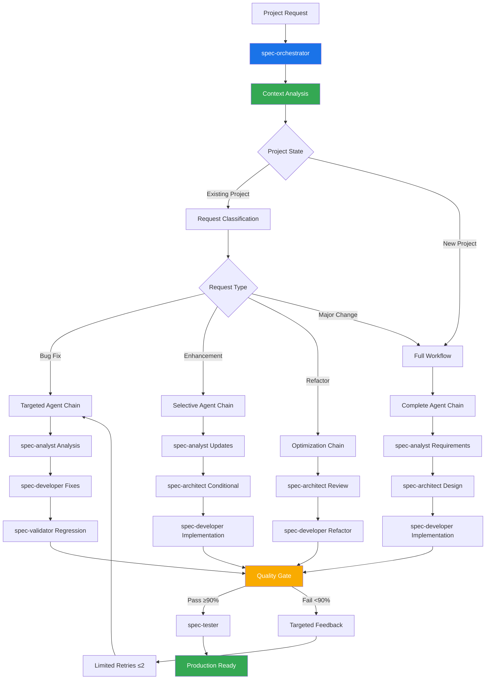

# Claude Sub-Agent Spec Workflow System

A comprehensive context-aware AI-driven development workflow system built on Claude Code's Sub-Agents feature, specifically designed for `manufacturing industry applications`. This system transforms manufacturing project ideas into production-ready .NET 9 applications through specialized AI agents working in coordinated phases with intelligent iteration management, optimized for compliance, integration, and multi-facility deployment scenarios.

## Table of Contents

- [Overview](#overview)
- [System Architecture](#system-architecture)
- [Installation](#installation)
- [Quick Start](#quick-start)
- [Context-Aware Workflow](#context-aware-workflow)
- [Documentation Organization](#documentation-organization)
- [Agent Reference](#agent-reference)
- [Usage Examples](#usage-examples)
- [Quality Gates](#quality-gates)
- [Best Practices](#best-practices)
- [Advanced Usage](#advanced-usage)
- [Troubleshooting](#troubleshooting)

## Overview

The Spec Workflow System leverages Claude Code's Sub-Agents capability to create a context-aware, multi-agent development pipeline optimized for .NET 9 manufacturing applications. Each agent is a specialized expert that understands existing project state, manufacturing domain requirements, and compliance needs while handling specific aspects of the industrial software development lifecycle.

### Key Features

- **Context-Aware Workflow**: Analyzes existing project state to avoid unnecessary regeneration
- **Request Type Classification**: Automatically determines if this is a new project, bug fix, enhancement, or refactor
- **Manufacturing Domain Focus**: Built-in understanding of compliance, integration, and multi-facility requirements
- **Organized Documentation**: Structured folder hierarchy prevents document chaos
- **Token Efficiency**: Minimal token usage through intelligent agent selection
- **Iterative Development**: Supports continuous improvement without starting from scratch
- **.NET 9 Manufacturing Stack**: Specialized for Clean Architecture, Entity Framework Core, and Azure deployment
- **Quality Gates**: Automated checkpoints with manufacturing-specific validation criteria

### Benefits

- Eliminates document chaos through organized iteration folders
- 70% reduction in token usage for iterative development
- Context-aware agent selection prevents unnecessary work
- Maintains project history through versioned iterations
- Optimized for .NET 9, Clean Architecture, and Azure deployment
- Built-in support for manufacturing compliance standards (FDA, HACCP, ISO)
- Specialized patterns for MES, SCADA, and ERP system integration
- Multi-facility deployment and configuration management

## System Architecture



## Installation

### Prerequisites

- Claude Code (latest version with Sub-Agents support)
- Project directory initialized
- .NET 9 SDK (for .NET projects)
- Basic understanding of AI-assisted development

### Setup Steps

1. **Download the agents**

   ```bash
   # Option 1: Clone the repository
   git clone https://github.com/jakeashcraft/claude-sub-agent.git
   cd claude-sub-agent
   
   # Option 2: Download specific agents you need
   # Individual agent files are available in the agents/ directory
   ```

2. **Copy agents and commands to your project's Claude Code directory**

   ```bash
   # Create .claude directory structure in your project
   mkdir -p .claude/agents .claude/commands .claude/docs
   
   # Copy all agents from categorized directories
   cp -r agents/*/*.md .claude/agents/
   
   # Copy the enhanced workflow command
   cp commands/agent-workflow.md .claude/commands/
   ```

3. **Initialize documentation structure**

   ```bash
   # Create organized documentation folders
   mkdir -p docs/{project,architecture,iterations,current,archive}
   
   # Initialize current state tracking
   touch docs/current/{active-tasks.md,known-issues.md,recent-changes.md}
   ```

4. **Verify installation**

   **Your project structure after installation:**

   ```text
   your-project/
   ├── .claude/
   │   ├── commands/
   │   │   └── agent-workflow.md      # Enhanced context-aware workflow
   │   ├── agents/
   │   │   ├── spec-orchestrator.md   # .NET 9 Context-aware orchestrator
   │   │   ├── spec-analyst.md        # Requirements analyst
   │   │   ├── spec-architect.md      # .NET 9 system architect
   │   │   ├── spec-developer.md      # .NET 9 implementation specialist
   │   │   ├── spec-validator.md      # .NET 9 quality validator
   │   │   ├── spec-tester.md         # .NET 9 testing specialist
   │   │   └── ...                    # Other specialized agents
   │   └── docs/                      # Organized documentation structure
   │       ├── project/               # Core project docs (stable)
   │       ├── architecture/          # System design docs
   │       ├── iterations/            # Version-controlled iterations
   │       ├── current/               # Active working state
   │       └── archive/               # Completed work
   ├── src/                           # .NET 9 source code
   ├── tests/                         # xUnit test projects
   ├── CLAUDE.md                      # Enhanced project guidance
   └── README.md                      # This file
   ```

## Quick Start

### Basic Usage (Context-Aware)

```bash
# For a new project
/agent-workflow "Create a .NET 9 Web API for managing inventory with Clean Architecture"

# For bug fixes on existing projects
/agent-workflow "The user login is failing with valid credentials"

# For enhancements to existing projects
/agent-workflow "Add real-time notifications using SignalR to the existing application"

# For refactoring existing code
/agent-workflow "Refactor the data access layer to use the Repository pattern"
```

### Simple Example with Context Awareness

```markdown
You: /agent-workflow "The user authentication is broken"

Claude (spec-orchestrator): Analyzing existing project state...
Found existing documentation in docs/
Classification: BUG_FIX workflow
Creating iteration: v2-bugfix-20241201-1430

[Context Analysis - 5 minutes]
✓ Existing requirements analyzed
✓ Issue classified as authentication bug
✓ Iteration v2-bugfix created
✓ Targeted agent chain selected

[Targeted Development - 45 minutes]  
✓ Root cause identified in JWT validation
✓ Authentication service fixed
✓ Regression tests added
✓ Quality Gate: PASSED (94/100)

Project updated! Changes in iteration v2-bugfix:
- AuthenticationService.cs updated
- New regression tests added
- Documentation updated in current/
- No unnecessary regeneration of existing docs
```

## Context-Aware Workflow

### Request Type Classification

The system automatically analyzes your request and existing project state to determine the optimal workflow:

#### NEW_PROJECT
- **Trigger**: No existing `docs/` structure
- **Keywords**: "create", "build", "new project", "from scratch"
- **Agent Chain**: Full workflow (analyst → architect → developer → validator → tester)
- **Documentation**: Complete initial documentation set

#### BUG_FIX  
- **Trigger**: Existing project + issue description
- **Keywords**: "bug", "broken", "not working", "error", "fails"
- **Agent Chain**: Targeted (analyst analysis → developer fixes → validator regression)
- **Documentation**: Issue analysis + fix documentation in iteration folder

#### ENHANCEMENT
- **Trigger**: Existing project + new functionality
- **Keywords**: "add", "new feature", "enhance", "improve", "extend"
- **Agent Chain**: Selective (analyst updates → architect if needed → developer → validator → tester)
- **Documentation**: Requirements updates + implementation in iteration folder

#### REFACTOR
- **Trigger**: Code improvement without new functionality
- **Keywords**: "refactor", "clean up", "optimize", "improve code"
- **Agent Chain**: Optimization (architect review → developer refactor → validator compliance)
- **Documentation**: Architecture improvements + refactoring notes

### Smart Agent Selection

The orchestrator intelligently selects only necessary agents:

```bash
# Bug fix example - Only 3 agents needed instead of 8
Bug Fix: spec-analyst → spec-developer → spec-validator

# Small enhancement - Skips architecture if no structural changes
Enhancement: spec-analyst → spec-developer → spec-validator → spec-tester

# Major feature - Includes architecture updates
Major Enhancement: spec-analyst → spec-architect → spec-developer → spec-validator → spec-tester

# Refactoring - Focuses on code quality
Refactor: spec-architect → spec-developer → spec-validator
```

## Documentation Organization

### Structured Folder Hierarchy

```
docs/
├── project/                    # Core project docs (rarely change)
│   ├── requirements.md         # Master requirements
│   ├── project-charter.md      # Project overview
│   ├── stakeholders.md         # Key contacts
│   └── success-criteria.md     # Definition of done
├── architecture/               # System design (update when needed)
│   ├── system-architecture.md  # Clean Architecture design
│   ├── api-specifications.md   # OpenAPI specs
│   ├── data-models.md          # Entity Framework models
│   ├── security-design.md      # Authentication & authorization
│   └── deployment-strategy.md  # Azure deployment plan
├── iterations/                 # Version-controlled changes
│   ├── v1-initial-setup/       # Initial project creation
│   │   ├── iteration-overview.md
│   │   ├── implementation-plan.md
│   │   ├── validation-report.md
│   │   └── retrospective.md
│   ├── v2-auth-bugfix/         # Authentication bug fixes
│   ├── v3-reporting-feature/   # New reporting functionality
│   └── v4-performance-opts/    # Performance optimizations
├── current/                    # Active working state
│   ├── request-analysis.md     # Current request classification
│   ├── active-tasks.md         # Work in progress
│   ├── known-issues.md         # Identified problems
│   ├── next-priorities.md      # Upcoming work
│   └── recent-changes.md       # Change log
└── archive/                    # Completed/obsolete docs
    └── old-requirements-v1.md
```

### Benefits of Organized Structure

- **No Document Chaos**: Instead of 59+ scattered files, logical organization
- **Version Control**: Each iteration has its own folder with complete context
- **Easy Navigation**: Clear hierarchy makes finding information simple
- **Change Tracking**: Complete history of what changed when and why
- **Token Efficiency**: Agents read only relevant existing documentation

## Agent Reference

### Enhanced Agent Capabilities

All agents now include:
- **Context Awareness**: Read existing project state before starting work
- **Incremental Updates**: Update existing documents rather than recreate
- **Iteration Management**: Organize work into versioned iterations  
- **.NET 9 Optimization**: Specialized knowledge of .NET 9, Clean Architecture, EF Core
- **Azure Integration**: Deployment-ready configurations for Azure App Service/AKS

### Core Workflow Agents (.NET 9 Enhanced)

| Agent | Purpose | Context-Aware Features | .NET 9 Specialization |
|-------|---------|----------------------|---------------------|
| spec-orchestrator | Workflow coordination & request classification | Analyzes existing docs, selects optimal agent chain | .NET project structure, quality gates |
| spec-analyst | Requirements analysis | Updates existing requirements incrementally | C# domain modeling, user stories |
| spec-architect | System design | Enhances existing architecture, minimal changes | Clean Architecture, EF Core, Azure |
| **database-specialist** | **Manufacturing database expertise** | **Auto-included for database-intensive requests** | **Historian integration, FDA compliance, time-series optimization** |
| spec-developer | Implementation | Follows existing patterns, targeted changes | Modern C# 13, ASP.NET Core, Entity Framework |
| spec-validator | Quality validation | .NET-specific quality criteria, regression testing | Code coverage, security, performance |
| spec-tester | Testing | Extends existing test suites, regression focus | xUnit, integration tests, mocking patterns |

### Quality Gate Integration

Each agent contributes to .NET-specific quality metrics:

- **Requirements Coverage**: 95% (business rules clearly defined)
- **Clean Architecture Compliance**: 90% (proper layer separation)
- **Code Coverage**: 85% (xUnit tests with meaningful assertions)
- **Security Score**: 95% (OWASP compliance, proper authentication)
- **Performance Score**: 90% (response times, memory usage)
- **Azure Readiness**: 85% (deployment configuration, monitoring)

## Usage Examples

### Example 1: New .NET 9 Enterprise Application

```bash
/agent-workflow "Create a .NET 9 enterprise application for managing manufacturing processes across 5 US facilities with Entra authentication and role-based access control, real-time monitoring, and Azure deployment"

# Expected behavior:
# - Classification: NEW_PROJECT
# - Full agent chain executed
# - Complete documentation structure created
# - Clean Architecture with .NET 9
# - Entity Framework Core for data access  
# - Azure App Service deployment configuration
# - Comprehensive test suite with xUnit
```

### Example 2: Bug Fix for Existing Project

```bash
/agent-workflow "User authentication is failing after the recent Azure AD B2C integration"

# Expected behavior:
# - Classification: BUG_FIX
# - Reads existing authentication architecture
# - Creates iteration v3-auth-bugfix/
# - Targeted agent chain: analyst → developer → validator
# - Minimal documentation updates
# - Regression tests added
# - No unnecessary architecture regeneration
```

### Example 3: Adding New Feature

```bash
/agent-workflow "Add real-time inventory tracking with SignalR to the existing manufacturing application"

# Expected behavior:
# - Classification: ENHANCEMENT  
# - Updates existing requirements in new iteration
# - Evaluates if architecture changes needed (yes, SignalR)
# - Selective agent chain: analyst → architect → developer → validator → tester
# - Extends existing test suite
# - Documents SignalR configuration
```

### Example 4: Database-Intensive Manufacturing Enhancement

```bash
/agent-workflow "Add Wonderware Historian integration for real-time SPC control charts with FDA audit trail"

# Expected behavior:
# - Classification: ENHANCEMENT  
# - Database keywords detected: "wonderware", "historian", "real-time", "FDA audit trail"
# - Agent chain: analyst → architect → database-specialist → developer → validator → tester
# - Database-specialist provides: Historian integration patterns, time-series optimization, FDA compliance schemas
# - Creates manufacturing-specific database models and queries
# - Implements regulatory compliance audit trails
# - Extends test suite with historian integration tests
```

### Example 5: Performance Refactoring

```bash
/agent-workflow "Optimize the data access layer performance using EF Core best practices and caching"

# Expected behavior:
# - Classification: REFACTOR
# - Reviews existing architecture
# - Agent chain: architect → developer → validator
# - Focuses on Entity Framework optimization
# - Implements Redis caching
# - Validates no functionality changes
# - Performance benchmarking tests
```

## Quality Gates

### .NET 9 Specific Quality Gates

#### Gate 1: Planning Quality (95% threshold)
- Requirements completeness and .NET alignment
- Clean Architecture feasibility assessment  
- Entity Framework model validity
- Azure deployment strategy validation
- Security design compliance

#### Gate 2: Development Quality (90% threshold)
- C# code quality (StyleCop, analyzers)
- Unit test coverage (≥85% with xUnit)
- Clean Architecture layer compliance
- Entity Framework performance patterns
- Security implementation (authentication, authorization)

#### Gate 3: Production Readiness (85% threshold)
- Overall quality score aggregation
- Azure deployment readiness
- Application Insights monitoring configuration
- Documentation completeness
- Operational runbook validation

### Context-Aware Quality Assessment

Quality gates now consider project context:
- **Bug Fixes**: Focus on regression prevention and fix validation
- **Enhancements**: Validate integration with existing system
- **Refactoring**: Ensure no functional changes occurred
- **New Projects**: Full comprehensive quality assessment

## Best Practices

### 1. Leveraging Context Awareness

- **Start Small**: Begin with bug fixes to understand the system
- **Trust Classification**: Let the orchestrator determine the optimal workflow
- **Review Iterations**: Check iteration folders to understand project evolution
- **Maintain Clean State**: Keep current/ folder updated with active work

### 2. .NET 9 Development

- **Follow Clean Architecture**: Use the established layer patterns
- **Entity Framework Best Practices**: Leverage EF Core optimizations
- **Modern C# Features**: Use records, pattern matching, nullable reference types
- **Azure Integration**: Design for cloud-native deployment from the start

### 3. Documentation Management

- **Stable vs Dynamic**: Keep core docs in project/, changes in iterations/
- **Version Control**: Each significant change gets its own iteration folder
- **Change Tracking**: Always update recent-changes.md with summaries
- **Archive Old**: Move obsolete documents to archive/ folder

### 4. Token Optimization

- **Precise Requests**: Be specific about what needs to be changed
- **Trust Context**: Let agents read existing state rather than re-explaining
- **Incremental Work**: Make small, focused changes rather than large rewrites
- **Validate Scope**: Ensure changes are necessary before starting

## Advanced Usage

### Custom Workflow Configuration

```json
{
  "requestClassification": {
    "forceType": "ENHANCEMENT",
    "skipAnalysis": false
  },
  "qualityThresholds": {
    "planning": 90,
    "development": 85,
    "validation": 80
  },
  "agentSelection": {
    "skipArchitect": false,
    "forceTesting": true,
    "customValidation": ["security-scan", "performance-benchmark"]
  },
  "documentationStrategy": {
    "iterationNaming": "v{version}-{type}-{timestamp}",
    "archiveThreshold": "30 days",
    "contextDepth": 3
  }
}
```

### Integration with CI/CD

```yaml
# GitHub Actions with context-aware validation
name: .NET Context-Aware Validation
on: [pull_request]

jobs:
  validate-changes:
    runs-on: ubuntu-latest
    steps:
      - uses: actions/checkout@v4
      
      - name: Detect Change Type
        id: change-detection
        run: |
          # Analyze docs/current/recent-changes.md
          # Determine if this requires validation
          echo "change-type=${{ env.CHANGE_TYPE }}" >> $GITHUB_OUTPUT
          
      - name: Context-Aware Validation
        if: steps.change-detection.outputs.change-type != 'documentation'
        run: |
          # Run appropriate validation based on change type
          /agent-workflow "Validate recent changes" --phase=validation
```

### Manufacturing Facility Deployment

```bash
# Specialized deployment for manufacturing environments
/agent-workflow "Deploy the inventory system to Facility #3 in with local compliance requirements and integration with existing MES systems"

# Context considerations:
# - Multi-facility deployment patterns
# - Manufacturing execution system integration  
# - Compliance and audit requirements
# - Real-time production data integration
# - Facility-specific configurations
```

## Troubleshooting

### Context-Aware Issues

1. **Wrong Request Classification**
   ```bash
   # Force specific request type
   /agent-workflow "Add reporting feature" --force-type=ENHANCEMENT
   ```

2. **Missing Context**
   ```bash
   # Check if docs/ structure exists
   ls -la docs/
   
   # Initialize if missing
   /agent-workflow "Initialize project context" --force-type=NEW_PROJECT
   ```

3. **Document Chaos (Legacy Projects)**
   ```bash
   # Migrate existing scattered docs to organized structure
   /agent-workflow "Organize existing documentation into iteration structure"
   ```

4. **Agent Selection Issues**
   ```bash
   # Override agent selection
   /agent-workflow "Fix authentication bug" --agents="spec-developer,spec-validator"
   ```

### .NET 9 Specific Issues

1. **Clean Architecture Violations**
   - Check validation reports in iterations/
   - Review architecture compliance scores
   - Use spec-architect for architectural reviews

2. **Entity Framework Performance**
   - Check query analysis in validation reports
   - Review data access patterns
   - Consider using spec-validator for performance assessment

3. **Azure Deployment Issues**
   - Validate deployment configuration
   - Check Application Insights setup
   - Review security configurations

### Debug Mode

```bash
# Enable comprehensive debugging
/agent-workflow "Debug request classification and agent selection" --debug=true --verbose=true
```

## Migration from v1

If you're migrating from the original workflow system:

1. **Backup Current Work**
   ```bash
   cp -r docs/ docs-backup/
   ```

2. **Initialize New Structure**
   ```bash
   /agent-workflow "Migrate existing project to context-aware structure" --migration-mode=true
   ```

3. **Verify Migration**
   ```bash
   # Check that all existing docs are properly organized
   ls -la docs/
   ```

## Contributing

We welcome contributions to improve the context-aware workflow system:

1. Follow .NET coding standards and Clean Architecture principles
2. Add comprehensive documentation with examples
3. Include context-aware behavior in new agents
4. Test with the enhanced orchestrator
5. Submit PR with detailed description of improvements

## License

MIT License - see LICENSE file for details

## Acknowledgments

- Built on Claude Code's Sub-Agents feature
- Optimized for .NET 9 and Clean Architecture patterns
- Inspired by enterprise software development best practices
- Community contributions from manufacturing industry specialists

---

For more information, see:

**Development Resources:**
- [Claude Code Documentation](https://docs.anthropic.com/en/docs/claude-code)
- [Sub-Agents Guide](https://docs.anthropic.com/en/docs/claude-code/sub-agents)
- [.NET 9 Documentation](https://docs.microsoft.com/en-us/dotnet/)
- [Clean Architecture Principles](https://blog.cleancoder.com/uncle-bob/2012/08/13/the-clean-architecture.html)
- [Project Issues](https://github.com/jakeashcraft/claude-sub-agent/issues)

**Manufacturing Compliance Standards:**
- [FDA 21 CFR Part 11](https://www.fda.gov/regulatory-information/search-fda-guidance-documents/part-11-electronic-records-electronic-signatures-scope-and-application) - Electronic Records and Electronic Signatures
- [HACCP Guidelines](https://www.fda.gov/food/guidance-regulation-food-and-dietary-supplements/hazard-analysis-critical-control-points-haccp) - Hazard Analysis Critical Control Points
- [ISO 22000:2018](https://www.iso.org/standard/65464.html) - Food Safety Management Systems
- [SOX Compliance](https://www.sec.gov/page/oxsarbanesoxleyact) - Sarbanes-Oxley Act Requirements
- [GMP Guidelines](https://www.fda.gov/drugs/pharmaceutical-quality-resources/current-good-manufacturing-practice-cgmp-regulations) - Current Good Manufacturing Practice

**System Integration Resources:**
- [MES Integration Patterns](https://www.mesa.org/en/modelinglibrary/mesa-model.asp) - Manufacturing Execution Systems
- [SCADA System Architecture](https://www.automationworld.com/factory/scada/article/13316495/scada-system-architecture-and-design) - Supervisory Control and Data Acquisition
- [Azure Industrial IoT](https://azure.microsoft.com/en-us/solutions/industry/manufacturing/) - Cloud Manufacturing Solutions