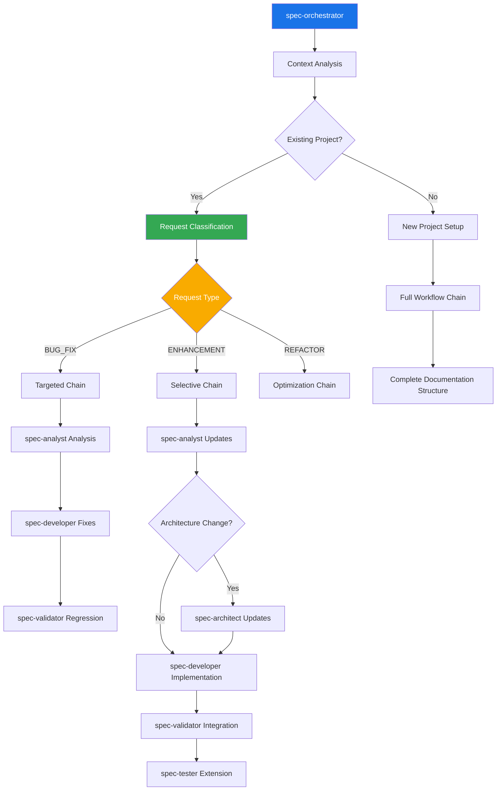

# Agent Directory Structure

This directory contains specialized AI agents for the Claude Sub-Agent context-aware workflow system, optimized for .NET 9 development with Clean Architecture patterns and Azure deployment scenarios.

## Directory Organization

```
agents/
├── spec-agents/                      # Context-aware spec workflow agents
│   ├── spec-orchestrator.md          # .NET 9 context-aware workflow coordinator
│   ├── spec-analyst.md               # C# requirements analysis specialist  
│   ├── spec-architect.md             # Clean Architecture system designer
│   ├── spec-developer.md             # .NET 9 implementation specialist
│   ├── spec-validator.md             # .NET quality validation expert
│   └── spec-tester.md                # xUnit comprehensive testing expert
│
├── backend/                          # .NET backend specialized agents
│   └── senior-backend-architect.md   # .NET 9 backend systems & microservices expert
│
├── frontend/                         # .NET frontend specialized agents  
│   └── senior-frontend-architect.md  # Blazor Server/WebAssembly expert
│
├── ui-ux/                            # UI/UX design agents
│   └── ui-ux-master.md               # Blazor component design & accessibility expert
│
└── utility/                          # Utility agents
    └── refactor-agent.md             # .NET code quality & refactoring specialist
```

## Agent Categories

### 1. Context-Aware Spec Workflow Agents

The core workflow system that provides intelligent, context-aware development lifecycle management:

#### Request Type Classification & Routing
- **NEW_PROJECT**: Full workflow chain for greenfield .NET 9 projects
- **BUG_FIX**: Targeted chain (analysis → fixes → regression testing)
- **ENHANCEMENT**: Selective chain (requirements → architecture if needed → implementation)
- **REFACTOR**: Optimization chain (architecture review → code improvement → validation)

#### Agent Workflow Chains
```
NEW_PROJECT Flow:
spec-orchestrator → spec-analyst → spec-architect → spec-developer → spec-validator → spec-tester

BUG_FIX Flow:  
spec-orchestrator → spec-analyst (analysis) → spec-developer (fixes) → spec-validator (regression)

ENHANCEMENT Flow:
spec-orchestrator → spec-analyst (updates) → [spec-architect (conditional)] → spec-developer → spec-validator → spec-tester

REFACTOR Flow:
spec-orchestrator → spec-architect (review) → spec-developer (refactor) → spec-validator (compliance)
```

#### Documentation Organization Management
All agents work with structured documentation:

- **project/**: Stable core documentation (requirements, charter, success criteria)
- **architecture/**: System design docs (Clean Architecture, API specs, data models)
- **iterations/**: Version-controlled changes (v1-initial, v2-bugfix, v3-feature)
- **current/**: Active state tracking (tasks, issues, recent changes)
- **archive/**: Historical documentation

### 2. .NET 9 Domain Specialists

Expert agents optimized for Microsoft technology stack and enterprise manufacturing environments:

#### Backend Specialists
- **senior-backend-architect**: .NET 9 backend systems, Clean Architecture, Entity Framework Core, Azure services integration, microservices patterns for multi-facility deployments

#### Frontend Specialists  
- **senior-frontend-architect**: Blazor Server/WebAssembly, SignalR real-time updates, component libraries, dashboard design

#### UI/UX Specialists
- **ui-ux-master**: Blazor component design systems, accessibility compliance, interface design, responsive layouts for factory floor environments

### 3. Quality-Focused Utility Agents

- **refactor-agent**: .NET code quality improvement, Clean Architecture compliance, Entity Framework optimization, performance tuning for industrial data loads

## Context-Aware Usage Patterns

### Intelligent Workflow Execution

```bash
# Context-aware automatic classification
/agent-workflow "The login system is broken after the Azure AD integration"
# → Automatically classified as BUG_FIX
# → Uses targeted agent chain: orchestrator → analyst → developer → validator
# → Creates iteration folder: v3-auth-bugfix-20241201
# → No unnecessary architecture or requirements regeneration

# New feature with context awareness  
/agent-workflow "Add real-time production monitoring dashboard to the existing system"
# → Automatically classified as ENHANCEMENT
# → Reads existing architecture and requirements
# → Uses selective chain: orchestrator → analyst → architect → developer → validator → tester
# → Updates existing docs incrementally in new iteration folder

# Performance optimization
/agent-workflow "Optimize Entity Framework queries for the inventory reports"  
# → Automatically classified as REFACTOR
# → Uses optimization chain: orchestrator → architect → developer → validator
# → Focuses on code improvement without functional changes
```

### Direct Agent Usage with Context

```bash
# Context-aware requirements analysis
Use spec-analyst: Analyze the new compliance requirements against existing project documentation

# Architecture enhancement
Use spec-architect: Review existing Clean Architecture and recommend improvements for the new reporting module

# Targeted development
Use spec-developer: Implement the authentication fixes following existing code patterns and architecture

# Quality validation with .NET focus
Use spec-validator: Evaluate the recent changes against .NET 9 best practices and Azure deployment readiness
```

## .NET 9 Quality Gates

The workflow includes three quality gates with .NET-specific criteria:

### Gate 1: Planning Quality (95% threshold)
- **Requirements Completeness**: Business rules clearly defined with C# domain modeling
- **Clean Architecture Feasibility**: Proper layer separation and dependency flow validation
- **Entity Framework Model Validity**: Database design and EF Core configuration assessment
- **Azure Deployment Strategy**: Infrastructure as code and deployment pipeline validation
- **Security Design Compliance**: Authentication, authorization, and data protection review

### Gate 2: Development Quality (90% threshold)  
- **C# Code Quality**: Roslyn analyzers, StyleCop compliance, nullable reference types usage
- **xUnit Test Coverage**: Minimum 85% with meaningful integration and unit tests
- **Clean Architecture Compliance**: Layer boundaries and dependency injection validation
- **Entity Framework Performance**: Query optimization, change tracking, bulk operations
- **Security Implementation**: Input validation, authentication flows, authorization policies

### Gate 3: Production Readiness (85% threshold)
- **Overall Quality Score**: Aggregated .NET quality metrics
- **Azure Deployment Readiness**: App Service configuration, Key Vault integration, monitoring setup
- **Application Insights Integration**: Telemetry, logging, performance monitoring configuration  
- **Documentation Completeness**: API documentation, deployment guides, operational runbooks
- **Manufacturing Environment Readiness**: Multi-facility deployment patterns, compliance validation

## Context-Aware Integration Patterns

### Inter-Agent Communication


### Specialist Integration
- **UI/UX Master**: Provides Blazor component designs → Spec Architect incorporates into Clean Architecture → Spec Developer implements with proper dependency injection
- **Senior Backend Architect**: Enhances microservices patterns → Spec Architect validates against Clean Architecture → Spec Developer implements with Entity Framework
- **Senior Frontend Architect**: Guides Blazor/SignalR implementation → Spec Developer follows established patterns → Spec Tester creates comprehensive component tests

## Manufacturing-Specific Usage

### Multi-Facility Deployment Scenarios
```bash
# Facility-specific configuration management
/agent-workflow "Deploy inventory system to facility #5 with local compliance requirements and MES integration"
# → Classification: ENHANCEMENT with manufacturing context
# → Considers FDA compliance, HACCP requirements, industrial network security
# → Generates facility-specific configuration and integration patterns

# Production line integration
/agent-workflow "Add real-time production data collection from Line 3 packaging equipment" 
# → Classification: ENHANCEMENT with SCADA integration
# → Uses manufacturing data patterns and real-time processing architecture
# → Includes proper error handling for equipment connectivity issues
```

### Compliance and Regulatory Context
- **FDA Compliance**: Food safety data handling, audit trail requirements
- **HACCP Integration**: Hazard analysis and critical control point monitoring
- **Industry Standards**: Manufacturing execution system (MES) integration patterns
- **Security Requirements**: Industrial network security, role-based facility access

## Best Practices

### 1. Leverage Context Awareness
- **Trust Automatic Classification**: Let spec-orchestrator analyze and route requests appropriately
- **Provide Context**: Mention existing functionality when describing changes
- **Use Iteration Folders**: Each significant change gets its own versioned folder
- **Maintain Current State**: Keep active tasks and issues updated in current/ folder

### 2. .NET 9 Development Excellence
- **Follow Clean Architecture**: Maintain proper layer separation and dependency flow
- **Entity Framework Best Practices**: Use proper change tracking, query optimization, migrations
- **Modern C# Patterns**: Leverage records, pattern matching, nullable reference types consistently
- **Azure-First Design**: Plan for cloud deployment, monitoring, and scaling from the start

### 3. Token Efficiency Optimization
- **Precise Change Requests**: Be specific about what needs modification
- **Leverage Existing Context**: Agents read current state automatically
- **Incremental Development**: Make focused changes rather than large rewrites
- **Trust Agent Selection**: Allow orchestrator to choose minimal necessary agents

### 4. Quality Assurance
- **Embrace Quality Gates**: Use the enhanced thresholds for consistent excellence
- **Iterative Improvement**: Maximum 2 retry cycles prevent infinite loops
- **Comprehensive Testing**: Ensure xUnit coverage meets enterprise standards
- **Security by Design**: Implement proper authentication and authorization throughout

## Token Usage Optimization

### Efficiency Improvements
- **70% Reduction**: Context-aware workflows eliminate unnecessary regeneration
- **Smart Agent Selection**: Only execute agents needed for specific change types
- **Incremental Documentation**: Update existing docs rather than recreate
- **Limited Retries**: Maximum 2 improvement cycles prevent token waste

### Usage Patterns
```
Traditional Approach (High Token Usage):
Bug Fix Request → Full workflow regeneration → All 8 agents → Complete documentation rewrite

Context-Aware (Optimized Token Usage):  
Bug Fix Request → Context analysis → Targeted 3 agents → Incremental documentation updates
```

## Contributing to Agent Development

When adding new agents to the system:

### Requirements
1. **Context Awareness**: Agent must read existing project state from `docs/` structure
2. **.NET 9 Specialization**: Include C# 13, Clean Architecture, Entity Framework Core expertise
3. **Incremental Updates**: Update existing documents rather than recreate
4. **Manufacturing Context**: Consider multi-facility deployment and compliance requirements
5. **Quality Integration**: Support enhanced quality gate criteria and scoring

### Agent Template Structure
```markdown
---
name: agent-name
description: Context-aware specialist for [domain] with .NET 9 optimization
tools: Read, Write, Edit, Glob, Grep, TodoWrite
---

# Agent Name - .NET 9 Context-Aware Specialist

## Context Awareness
- Read existing docs/ structure
- Understand current project state
- Classify request type and scope
- Update documentation incrementally

## .NET 9 Specialization
- Clean Architecture patterns
- Entity Framework Core best practices  
- Modern C# 13 features
- Azure deployment optimization
- Azure AD integration

[Additional agent-specific content...]
```

### Testing and Validation
1. Test with context-aware orchestrator
2. Verify incremental documentation updates
3. Validate .NET 9 specific outputs
4. Ensure manufacturing scenario compatibility
5. Check token efficiency improvements