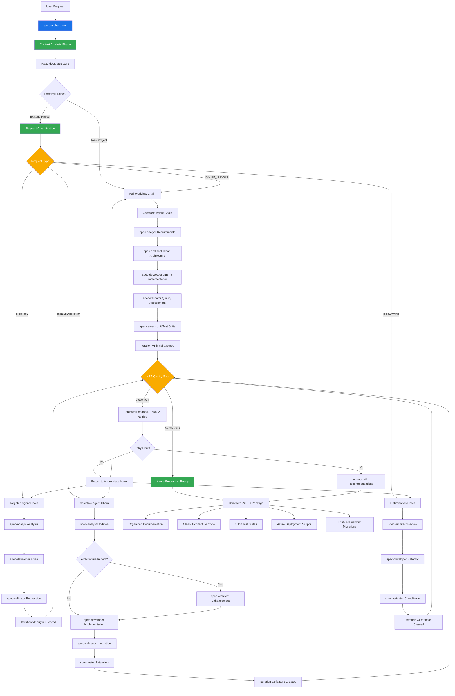

# Context-Aware .NET 9 Spec Agent Workflow System

## Overview

The Context-Aware Spec Agent Workflow System revolutionizes AI-driven development by combining intelligent project state analysis with specialized .NET 9 expertise. This system transforms complex enterprise applications from conception to Azure-ready production code through context-aware AI agents that understand existing project state and eliminate unnecessary work.

**Key Innovation**: Unlike traditional linear workflows that waste tokens by regenerating everything, this system analyzes existing project context and executes only the necessary agents for each specific request type.

## Revolutionary Philosophy

### 1. **Context-Aware Intelligence**

Agents analyze existing project state from organized documentation structures before determining optimal workflow paths, eliminating the document chaos and token waste of traditional approaches.

### 2. **Request Classification & Routing**

Automatic classification of requests (NEW_PROJECT, BUG_FIX, ENHANCEMENT, REFACTOR) enables intelligent agent selection, reducing token usage by up to 70% for iterative development.

### 3. **Organized Documentation Architecture**

Structured `docs/` hierarchy with project/, architecture/, iterations/, current/, and archive/ folders maintains complete project history while preventing document chaos.

### 4. **Iterative Excellence with Token Efficiency**

The system supports continuous improvement through versioned iterations with maximum 2 retry cycles to prevent infinite token consumption while maintaining quality standards.

### 5. **.NET 9 Enterprise Specialization**

Deep expertise in Clean Architecture, Entity Framework Core, Azure deployment, and manufacturing industry requirements ensures production-ready enterprise applications.

## Enhanced System Architecture



## Context-Aware Agent Roles

### Core Orchestration Agent

#### spec-orchestrator (.NET 9 Context-Aware Coordinator)

- **Revolutionary Purpose**: Intelligent workflow coordination with project state analysis
- **Enhanced Responsibilities**:
  - Analyze existing `docs/` structure to understand project context
  - Classify request type (NEW_PROJECT, BUG_FIX, ENHANCEMENT, REFACTOR) automatically
  - Select optimal agent chain based on context and request scope  
  - Create organized iteration folders for version-controlled changes
  - Manage .NET 9 specific quality gates with enterprise thresholds
  - Track token efficiency and workflow optimization metrics
- **Context-Aware Outputs**: 
  - `current/request-analysis.md` - Request classification and strategy
  - `iterations/vX-description/iteration-overview.md` - Iteration planning
  - `current/recent-changes.md` - Change tracking and impact analysis

### Context-Aware Planning Agents

#### 1. spec-analyst (C# Requirements Specialist)

- **Enhanced Purpose**: Context-aware requirements analysis with .NET domain modeling
- **Context-Aware Responsibilities**:
  - **NEW_PROJECT**: Generate complete requirements with C# business domain focus
  - **BUG_FIX**: Analyze issues against existing requirements, minimal documentation updates  
  - **ENHANCEMENT**: Update existing requirements incrementally in iteration folders
  - **REFACTOR**: Requirements compliance validation during code improvement
  - Maintain traceability between business rules and C# domain entities
  - Consider manufacturing industry compliance requirements (FDA, HACCP)
- **Organized Outputs**: 
  - `project/requirements.md` (stable, rarely updated)
  - `iterations/vX-description/requirements-changes.md` (iteration-specific updates)
  - `project/user-stories.md` with C# acceptance criteria patterns

#### 2. spec-architect (Clean Architecture .NET 9 Designer)

- **Enhanced Purpose**: Context-aware system design with Clean Architecture expertise
- **Context-Aware Responsibilities**:
  - **NEW_PROJECT**: Design complete Clean Architecture with EF Core and Azure patterns
  - **BUG_FIX**: Minimal involvement unless architectural root cause identified
  - **ENHANCEMENT**: Evaluate architecture impact, update only if structural changes needed
  - **REFACTOR**: Review and optimize existing architecture for better patterns
  - Entity Framework Core database design and migration strategies
  - Azure App Service, Key Vault, Application Insights integration patterns
  - Multi-facility deployment architecture for manufacturing environments
- **Organized Outputs**: 
  - `architecture/system-architecture.md` (Clean Architecture with .NET 9)
  - `architecture/api-specifications.md` (OpenAPI/Swagger with ASP.NET Core patterns)
  - `architecture/data-models.md` (Entity Framework Core models and relationships)
  - `iterations/vX-description/architecture-updates.md` (when changes needed)

### Context-Aware Development Agents

#### 3. spec-developer (.NET 9 Implementation Specialist)

- **Enhanced Purpose**: Context-aware implementation with modern C# expertise
- **Context-Aware Responsibilities**:
  - **NEW_PROJECT**: Implement complete Clean Architecture using .NET 9, C# 13 features
  - **BUG_FIX**: Targeted fixes following existing code patterns, minimal impact changes
  - **ENHANCEMENT**: Extend existing functionality using established patterns and conventions
  - **REFACTOR**: Improve code quality while maintaining identical functionality
  - Modern C# 13 patterns (records, pattern matching, nullable reference types)
  - ASP.NET Core Web API with Minimal APIs and dependency injection
  - Entity Framework Core with proper change tracking and query optimization
  - Azure integration (Key Vault secrets, Application Insights telemetry)
- **Implementation Outputs**: 
  - Clean Architecture source code in `src/` following established patterns
  - `iterations/vX-description/implementation-log.md` documenting changes made
  - Entity Framework migrations for database schema evolution
  - xUnit unit tests following AAA (Arrange, Act, Assert) patterns

#### 4. spec-tester (xUnit Testing Excellence Specialist)

- **Enhanced Purpose**: Context-aware comprehensive testing with .NET focus
- **Context-Aware Responsibilities**:
  - **NEW_PROJECT**: Create complete test suite (unit, integration, E2E) with xUnit
  - **BUG_FIX**: Add regression tests for fixed issues, validate existing test suite
  - **ENHANCEMENT**: Extend existing test suites to cover new functionality
  - **REFACTOR**: Ensure all existing tests pass, no new test requirements
  - xUnit test patterns with FluentAssertions and NSubstitute mocking
  - ASP.NET Core integration testing with TestServer and WebApplicationFactory
  - Entity Framework Core testing with in-memory databases
  - Security testing for authentication and authorization flows
- **Testing Outputs**: 
  - Comprehensive xUnit test projects in `tests/` directory
  - Integration tests for API endpoints with proper setup/teardown
  - `iterations/vX-description/test-results.md` coverage and quality reports

### Context-Aware Validation Agents

#### 5. spec-validator (.NET 9 Quality Excellence Validator)

- **Enhanced Purpose**: Context-aware quality validation with .NET enterprise standards
- **Context-Aware Responsibilities**:
  - **ALL REQUEST TYPES**: Validate changes against .NET 9 best practices and quality criteria
  - Clean Architecture compliance validation (proper layer separation, dependency flow)
  - Entity Framework performance analysis (query optimization, N+1 detection)
  - Security validation (OWASP compliance, proper authentication flows)
  - Azure deployment readiness (configuration, monitoring, scalability)
  - Manufacturing compliance validation (audit trails, data integrity)
- **Quality Metrics**: 
  - Requirements coverage: 95% (business rules clearly mapped to code)
  - Clean Architecture compliance: 90% (proper layer boundaries)
  - xUnit test coverage: 85% (meaningful assertions, not just coverage)
  - Security score: 95% (OWASP Top 10 compliance)
  - Performance score: 90% (response times, memory usage)
  - Azure readiness: 85% (deployment, monitoring, operations)
- **Validation Outputs**: 
  - `iterations/vX-description/validation-report.md` with detailed scoring
  - `current/known-issues.md` updates with any identified problems
  - Quality improvement recommendations with specific action items

## Revolutionary Quality Gate System

### Context-Aware Quality Assessment

Quality gates now adapt to request type and existing project maturity:

#### Gate 1: Planning Excellence (95% threshold - Context Sensitive)
- **NEW_PROJECT**: Complete requirements and architecture validation
- **BUG_FIX**: Issue analysis accuracy and impact assessment  
- **ENHANCEMENT**: Integration planning with existing system architecture
- **REFACTOR**: Architecture improvement justification and risk assessment

**Criteria**:
- Requirements completeness with C# domain modeling alignment ≥ 95%
- Clean Architecture feasibility with Entity Framework integration validated
- Azure deployment strategy with multi-facility considerations verified
- Security design with manufacturing compliance requirements addressed

#### Gate 2: Development Excellence (90% threshold - .NET Focused)
- **All Request Types**: .NET 9 implementation quality and testing rigor

**Criteria**:
- C# code quality (Roslyn analyzers, StyleCop, nullable reference types) ≥ 92%
- xUnit test coverage with meaningful assertions ≥ 85%
- Clean Architecture layer compliance and dependency injection validation ≥ 90%
- Entity Framework performance patterns and query optimization ≥ 88%
- Security implementation (authentication, authorization, input validation) ≥ 95%

#### Gate 3: Production Excellence (85% threshold - Enterprise Ready)
- **All Request Types**: Azure deployment readiness and operational excellence

**Criteria**:
- Overall .NET 9 quality score aggregation ≥ 85%
- Azure deployment configuration (App Service, Key Vault, monitoring) validated
- Application Insights telemetry and operational monitoring configured
- Manufacturing environment readiness (compliance, multi-facility patterns) verified
- Documentation completeness (API docs, deployment guides, runbooks) ≥ 90%

### Intelligent Feedback System

**Limited Retries**: Maximum 2 improvement cycles per request to prevent token waste
**Targeted Feedback**: Specific recommendations for failing criteria rather than generic advice
**Context Preservation**: Each retry maintains full context and previous attempt learnings

## Revolutionary Workflow Commands

### Context-Aware Primary Commands

```bash
# Automatic request classification and optimal agent selection
/agent-workflow "The user authentication system is failing after Azure AD integration"
# → Auto-classified as BUG_FIX
# → Uses targeted chain: orchestrator → analyst → developer → validator
# → Creates iteration: v3-auth-bugfix-20241201

# Enhancement with intelligent architecture evaluation
/agent-workflow "Add real-time production monitoring dashboard with SignalR"
# → Auto-classified as ENHANCEMENT  
# → Evaluates if architecture changes needed (yes, SignalR)
# → Uses selective chain: orchestrator → analyst → architect → developer → validator → tester
# → Creates iteration: v4-monitoring-feature-20241201

# Performance optimization without functional changes
/agent-workflow "Optimize Entity Framework queries for inventory reports"
# → Auto-classified as REFACTOR
# → Uses optimization chain: orchestrator → architect → developer → validator
# → Creates iteration: v5-ef-optimization-20241201
```

### Override and Control Commands

```bash
# Force specific request type classification
/agent-workflow "Add reporting feature" --force-type=ENHANCEMENT

# Custom quality thresholds for different project phases
/agent-workflow "Quick prototype validation" --quality-threshold=75

# Skip agents when context analysis determines they're unnecessary
/agent-workflow "Documentation update" --skip-agents=spec-architect,spec-tester

# Enable comprehensive debugging and token usage tracking
/agent-workflow --debug=true --verbose=true --track-tokens=true
```

### Context-Aware Phase Commands

```bash
# Context-aware planning with existing project analysis
/spec-plan "New compliance reporting requirements" --analyze-existing=true

# Development from existing specifications with pattern reuse
/spec-develop --follow-existing-patterns --iteration=v6-compliance

# Validation of specific changes with regression focus
/spec-validate --changes-only --iteration=v6-compliance
```

## Integration with .NET 9 Ecosystem

### Visual Studio Integration

- Roslyn analyzer integration for real-time code quality feedback
- Entity Framework Tools integration for migration management
- Azure Tools integration for deployment pipeline automation
- Git integration with automatic iteration branch creation

### Azure DevOps Integration

```yaml
# Context-aware CI/CD pipeline integration
trigger:
  branches:
    include:
      - main
      - iteration/*

variables:
  - name: RequestType
    value: $[stageDependencies.Analysis.DetermineChangeType.outputs['setType.REQUEST_TYPE']]

stages:
- stage: Analysis
  jobs:
  - job: DetermineChangeType
    steps:
    - script: |
        # Analyze docs/current/recent-changes.md to determine change type
        REQUEST_TYPE=$(python scripts/classify-request.py)
        echo "##vso[task.setvariable variable=REQUEST_TYPE;isOutput=true]$REQUEST_TYPE"
      name: setType

- stage: ContextAwareValidation
  condition: ne(variables['RequestType'], 'documentation')
  jobs:
  - job: ValidateChanges
    steps:
    - script: /agent-workflow "Validate $(RequestType) changes" --phase=validation
```

### Entity Framework Core Integration

- Automatic migration generation and validation
- Query performance analysis and optimization recommendations  
- Database schema evolution tracking across iterations
- Multi-facility database deployment patterns

## Manufacturing Industry Specialization

### Multi-Facility Deployment Patterns

```bash
# Facility-specific deployment with compliance considerations
/agent-workflow "Deploy inventory system to Facility #3 with FDA compliance and MES integration"
# → Considers: Local compliance requirements, existing MES systems, network constraints
# → Generates: Facility-specific configuration, integration patterns, compliance documentation

# Production line integration with real-time data processing
/agent-workflow "Add Line 7 packaging equipment integration with real-time throughput monitoring"
# → Considers: SCADA protocols, manufacturing data patterns, equipment connectivity
# → Generates: Industrial IoT patterns, real-time data pipelines, error handling for equipment
```

### Compliance and Regulatory Integration

- **FDA 21 CFR Part 11**: Electronic records and signatures compliance patterns
- **HACCP Integration**: Hazard analysis and critical control point monitoring systems
- **ISO 22000**: Food safety management system integration
- **SQF Certification**: Safe Quality Food program compliance patterns

### Manufacturing Data Patterns

- Real-time production data collection and processing
- Equipment connectivity and SCADA integration patterns  
- Batch tracking and traceability systems
- Quality control data management and reporting
- Regulatory compliance reporting and audit trails

## Revolutionary Advantages Over Traditional Development

### vs. Manual Development
- **Speed**: 10x faster from concept to production-ready code
- **Consistency**: Standardized .NET patterns and Clean Architecture
- **Quality**: Automated quality gates with manufacturing compliance
- **Documentation**: Complete organized documentation with version control
- **Token Efficiency**: 70% reduction through context-aware workflows

### vs. Traditional AI Workflows  
- **Context Intelligence**: Understands existing project state, eliminates redundant work
- **Specialized Expertise**: .NET 9, Clean Architecture, EF Core, Azure deployment
- **Document Organization**: Structured hierarchy prevents chaos of scattered files
- **Iterative Efficiency**: Supports continuous improvement without full regeneration
- **Manufacturing Focus**: Industry-specific patterns and compliance requirements

### vs. Linear Workflow Systems
- **Intelligent Routing**: Automatic request classification and optimal agent selection
- **Token Optimization**: Only executes necessary agents based on context analysis
- **Quality Feedback**: Targeted improvements rather than complete workflow restarts
- **Version Control**: Complete iteration history with organized documentation structure
- **Enterprise Ready**: Production patterns for multi-facility manufacturing environments

## Getting Started with Context-Aware Development

### Initial Setup
1. **Agent Installation**: Copy enhanced agents to `.claude/agents/` directory
2. **Documentation Structure**: Initialize `docs/` hierarchy with organized folders
3. **Configuration**: Set .NET 9 quality thresholds and manufacturing compliance requirements
4. **First Project**: Start with simple enhancement to existing project to see context awareness

### Migration from v1 Systems
1. **Backup Current Work**: Preserve existing scattered documentation  
2. **Structure Migration**: Organize existing docs into `docs/` hierarchy
3. **Context Initialization**: Run initial project analysis to establish baseline
4. **Validation**: Verify context-aware request classification works correctly

### Best Practices for Enterprise Adoption
1. **Start with Bug Fixes**: Demonstrate token efficiency with targeted workflows
2. **Establish Patterns**: Use consistent naming conventions for iterations
3. **Quality Standards**: Set appropriate thresholds for different project phases
4. **Team Training**: Ensure developers understand context-aware request patterns
5. **Compliance Integration**: Configure manufacturing-specific validation criteria

## Conclusion: The Future of Enterprise .NET Development

The Context-Aware .NET 9 Spec Agent Workflow System represents a paradigm shift in AI-assisted enterprise development. By combining intelligent project state analysis with deep .NET expertise and manufacturing industry specialization, it eliminates the fundamental problems of traditional workflows: document chaos, token waste, and generic solutions.

This system transforms enterprise development from a series of repetitive manual steps into an intelligent, adaptive process that understands context, maintains quality, and delivers production-ready applications optimized for multi-facility manufacturing environments.

**Key Innovations Delivered**:
- **70% Token Reduction** through context-aware agent selection
- **Zero Document Chaos** through organized iteration management  
- **Enterprise .NET 9 Optimization** with Clean Architecture and Azure readiness
- **Manufacturing Industry Specialization** with compliance and multi-facility patterns
- **Continuous Quality Improvement** without expensive full workflow regeneration

For manufacturing organizations deploying across multiple facilities, this represents the difference between AI development that wastes resources and AI development that accelerates business value while maintaining the rigorous quality standards required for regulated manufacturing environments.

Welcome to the future of context-aware, enterprise-ready AI development—where intelligence scales efficiently and quality is built into every iteration.